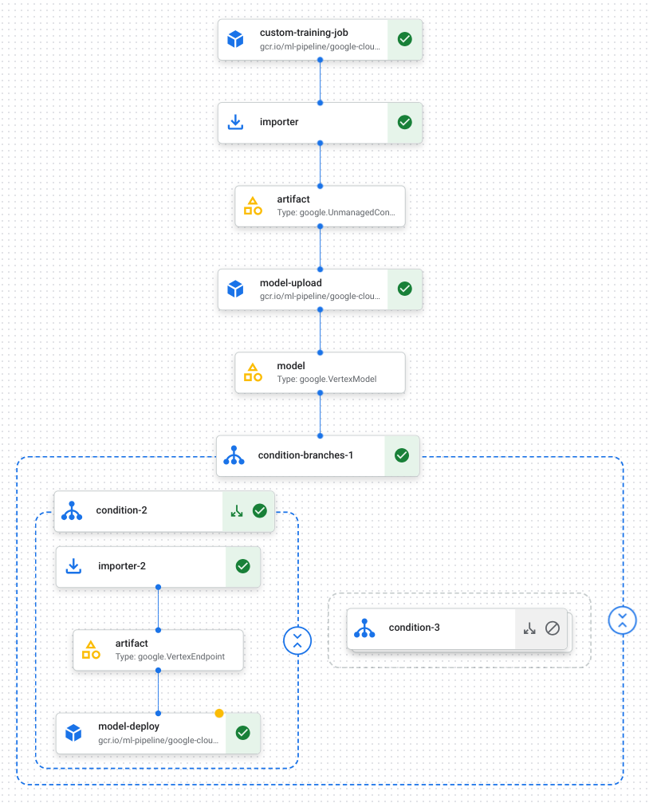

# Train with Cloud TPUs on Vertex AI

> This folder demonstrates how to build a pipeline that trains a custom model on TPUs and deploys the model to an online endpoint with GPUs

**high-level objectives**

1. train a custom model using TPUs
2. upload the model as a Vertex AI model resource
3. create a Vertex AI endpoint resource, and
4. deploy the model resource to the endpoint

## custom training package

```
├── 01_train_deploy_pipeline.ipynb
├── README.md
├── default_config.py
├── tpu-container-artifacts
│   ├── Dockerfile
│   └── train.py
└── tpu_train_cifar10_pipeline.json
```

## custom vertex pipeline

<details>
  <summary>Pipeline DAG in Google Cloud console</summary>


    
</details>