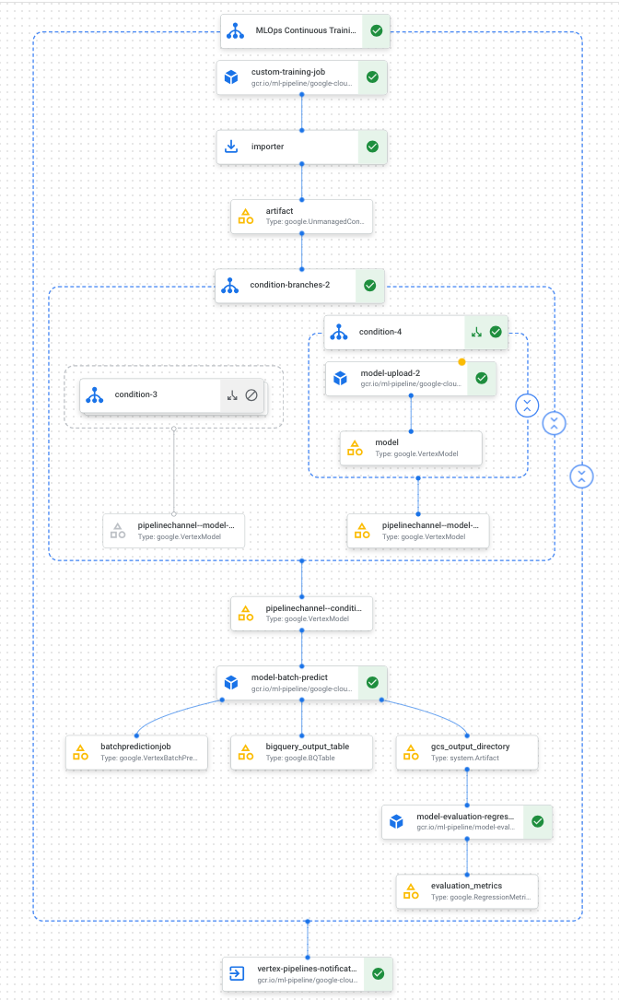

# mlops-w-vertex-ai

> This repo demonstrates how to build a pipeline that trains a custom model either on a periodic schedule or when new data is inserted into the dataset using Vertex AI Pipelines and Cloud Run functions

## objectives

1. Acquire and prepare dataset in BigQuery.

2. Create and upload a custom training package. When executed, it reads data from the dataset and trains the model.

3. Build a Vertex AI Pipeline. This pipeline executes the custom training package, uploads the model to the Vertex AI Model Registry, runs the evaluation job, and sends an email notification.

4. Manually run the pipeline.

5. Create a Cloud Function with an Eventarc **trigger** that runs the pipeline whenever new data is inserted into the BigQuery dataset.

### custom training package for Vertex Training

We'll create a Python package that contains the code for training a custom model in Vertex AI with a [prebuilt container](https://cloud.google.com/vertex-ai/docs/training/create-python-pre-built-container). This package will run as one of the steps in our continuous training pipeline

the structure of our package should look like this:

```
training_package
├── __init__.py
├── setup.py
└── trainer
    ├── __init__.py
    └── task.py
```

### Continuous training with Vertex AI Pipelines

<details>
  <summary>Pipeline DAG in Vertex AI console</summary>


    
</details>

### Setup instructions

<details>
  <summary>[1] pip installs</summary>

Run the following in a terminal:

```
pip3 install -r requirements.txt
```

</details>

<details>
  <summary>[2] Enable APIs and configure IAM</summary>

Replace values for `PROJECT_ID`, `PROJEC_NUM`, and `USER`, then run commands in terminal

[2.a] Set project and user login

```
gcloud config get-value project
export PROJECT_ID=

gcloud projects describe $PROJECT_ID --format="value(projectNumber)"
export PROJECT_NUM=

export USER=
```

[2.b] Grant roles in your Google Account

```
gcloud projects add-iam-policy-binding $PROJECT_ID --member=user:$USER --role=roles/bigquery.admin
gcloud projects add-iam-policy-binding $PROJECT_ID --member=user:$USER --role=roles/aiplatform.user
gcloud projects add-iam-policy-binding $PROJECT_ID --member=user:$USER --role=roles/storage.admin
gcloud projects add-iam-policy-binding $PROJECT_ID --member=user:$USER --role=roles/pubsub.editor
gcloud projects add-iam-policy-binding $PROJECT_ID --member=user:$USER --role=roles/cloudfunctions.admin
gcloud projects add-iam-policy-binding $PROJECT_ID --member=user:$USER --role=roles/logging.viewer
gcloud projects add-iam-policy-binding $PROJECT_ID --member=user:$USER --role=roles/logging.configWriter
gcloud projects add-iam-policy-binding $PROJECT_ID --member=user:$USER --role=roles/iam.serviceAccountUser
gcloud projects add-iam-policy-binding $PROJECT_ID --member=user:$USER --role=roles/eventarc.admin
gcloud projects add-iam-policy-binding $PROJECT_ID --member=user:$USER --role=roles/aiplatform.colabEnterpriseUser
gcloud projects add-iam-policy-binding $PROJECT_ID --member=user:$USER --role=roles/artifactregistry.admin
gcloud projects add-iam-policy-binding $PROJECT_ID --member=user:$USER --role=roles/serviceusage.serviceUsageAdmin
```

[2.c] Enable GCP APIs

```
gcloud services enable artifactregistry.googleapis.com \
    bigquery.googleapis.com \
    cloudbuild.googleapis.com \
    cloudfunctions.googleapis.com \
    logging.googleapis.com \
    pubsub.googleapis.com \
    run.googleapis.com \
    storage-component.googleapis.com  \
    eventarc.googleapis.com \
    serviceusage.googleapis.com \
    aiplatform.googleapis.com
```

[2.d] Grant service account IAM

```
gcloud projects add-iam-policy-binding $PROJECT_ID --member="serviceAccount:PROJECT_NUM-compute@developer.gserviceaccount.com" --role=roles/aiplatform.serviceAgent
gcloud projects add-iam-policy-binding $PROJECT_ID --member="serviceAccount:PROJECT_NUM-compute@developer.gserviceaccount.com" --role=roles/eventarc.eventReceiver
```
</details>

<details>
  <summary>[3] Create repo in the artifact registry</summary>
    
```
export REGION=us-central1
export REPO_NAME=mlops
gcloud artifacts repositories create $REPO_NAME --location=$REGION --repository-format=KFP
```
</details>